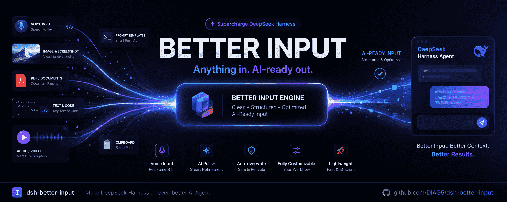

<p align="center">
  
</p>

<h1 align="center">🎤 sqs-dsh-better-input</h1>

<p align="center"><b>给 DeepSeek Harness 更好的「输入」体验。</b></p>

<p align="center">
  <a href="https://www.npmjs.com/package/sqs-dsh-better-input"></a>
  <a href="https://www.npmjs.com/package/sqs-dsh-better-input"></a>
  <a href="./LICENSE"></a>
</p>

<p align="center">
  输入体验增强插件 · 基于 dsh-better-input 的二次开发
</p>

> 💡 **它解决什么？** 与智能体对话，输入不只靠键盘打字。本插件把**语音识别、AI 润色、提示词优化、提示词模板**四件事做顺：说出来的话自动变成干净、可直接发送的文字；写好的提示词一键优化；常用提示词随用随插。

***

## ⚠️ 关于这个版本（二次开发说明）

本仓库是 [`dsh-better-input`](https://github.com/DIAG5/dsh-better-input)（MIT）的**二次开发版本**，由 **sanqianshuang** 维护。当前版本 **`0.2.0-rc.2`** —— **与它所适配的 DSH 主线同号**，一眼即可判断该装哪一版（`0.1.0` 适配的是 DSH `0.1.7-rc.2`）。与原版的主要差别：

| 变更 | 说明 |
| --- | --- |
| 🔧 **修复「插件被 DSH 静默丢弃」（关键）** | `0.1.0` 声明的 peer 范围是 `>=0.1.7-rc.2 <0.2.0-0`，而 `0.2.0-rc.2` **不满足** `<0.2.0-0`（`0.2.0-0` 是 `0.2.0` 的最小 prerelease）。DSH 的兼容性预检因此把整个 bundle 降级丢弃——插件完全没加载，Host 服务、麦克风按钮、设置页全部消失，而 `npm run build` / `tsc` / 各构建守卫**全部照常通过**。现收紧为 `>=0.2.0-rc.2 <0.3.0-0`，并新增 `npm run check:peers` 守卫（以 DSH 自身的兼容性判定为准）防复发。 |
| 🎙️ **语音识别改用 DSH 自带的本地识别器** | 不再使用浏览器 Web Speech API（Chrome/Edge 上那其实是**云端识别**，音频会上行给浏览器厂商）。改为把 16 kHz 单声道 PCM16 WAV 交给 dsh 的语音服务，由本地 SenseVoice 在**本机 CPU** 上转写：**离线可用、音频不出机器、无需厂商凭据**。语种随之收窄为 自动 / 中文 / 英语 / 粤语 / 日语 / 韩语。详见 [CHANGELOG](./CHANGELOG.md) `[0.2.0-rc.2]`。 |
| 🔀 **保留「边说边出字」** | dsh 的语音服务只有整段转写（没有流式接口），所以流式由本插件自己做：录制时按静音优先、默认每 3 秒切段转写并流入输入框；**停止后用整段录音重转一次作为最终稿**再润色 —— 分段只影响预览观感，不会污染最终文本。 |
| ⏱️ **识别条重做：贴齐输入框 + 计时 + 静音自动停止** | 原识别条是 `conversation.input.dock` 槽位里唯一没有自己做宽度约束的条目，会被 flex 父级拉满整列，**比输入框宽出一大截**；现在按 dsh 自己的 dock 约定（`--dsh-composer-card-max-width` / `--dsh-composer-side-clearance`）居中贴齐输入框。同时条上新增**已监听时长**（`mm:ss`）、**实时音量表**与**静音倒计时**：说话后静音满 10 秒（可调、可关）自动停止并转写。 |
| 🗑️ **移除「文件输入 / 文件转 Markdown / OCR」整块** | DSH `0.1.7` 已原生支持文件拖拽上传、上传进度、文件卡片与重试（`conversation.input.attachments` / `DropOverlay` / `FileCard`），插件再挂一套 📎 文件面板与 `@` 引用芯片属于重复实现，故整体删除。 |
| 🔧 **修复 Typert 兼容性** | `0.1.7` 收紧了 Typert 边界：`mode: 'strict'` 的 codec 必须带 **`create()` 工厂**；旧版把 schema 直接放在 `schema` 属性上，会被 `requireStrictCodec` 拒绝（报 `strict codec has no create() factory`），导致整个 entry 无法激活、插件根本不加载。现已全部改为工厂形式。 |
| 🔧 **修复设置存储被移除的 API** | `0.1.7` 删除了 `settings.register(namespace, schema)`（`0.2.0` 仍无此 API），改为按 profile entry 的 `SettingsForms`（带 revision CAS）。本插件的设置改为**自持 JSON 文件**，不再依赖该 API，因而不会被后续版本反复打破。 |
| 🔧 **对齐依赖版本** | `@deepseek-ai/cordis` → `~4.0.4`、`@deepseek-ai/schemastery` → `~3.18.4`；全部 `@deepseek-ai/dsh-*` 类型包钉到 `0.2.0-rc.2`，peer 范围 `>=0.2.0-rc.2 <0.3.0-0`。 |
| 🏷️ **身份与命名** | 包名 `sqs-dsh-better-input`（npm 同名）、作者 `sanqianshuang`；设置与模板数据目录为 `~/.dsh/sqs-dsh-better-input/`（与原版互不干扰，可并存安装）。 |

> **从 `0.1.0` 升级**：设置项、数据目录与用户可见行为**向下兼容**，不需要迁移任何数据；本版新增的设置键（`streamingPreview` / `segmentSeconds` / `autoStopSeconds`）在读取旧 `settings.json` 时自动补齐，越界值读取即修复。

> **与 DSH 自带的语音输入的关系（重要）**：`0.2.0` 增加了一个**可选且默认关闭**的 bundle
> `@deepseek-ai/dsh-experimental-voice-input-bundle`，它带来 DSH 自己的麦克风
> （`conversation.input.activity` 槽位，位于模型选择器与发送按钮之间）与**本地 SenseVoice 识别器**。
>
> 本插件的麦克风在 `conversation.input.right`（模型选择器左侧），两者**槽位不冲突、可同时开启**；
> 但**功能上重叠**：本版起本插件也用同一个本地识别器。区别在于本插件额外提供
> **分段流式上屏**、识别后的 **AI 润色**、**提示词优化**与**模板库** —— DSH 自带的那个转写完就直接进草稿，没有任何后处理。
>
> 因此：**本插件必须依赖该 bundle 提供的识别服务**（在插件管理页启用「语音输入」并完成约 239 MB 的模型准备）。
> 未启用时本插件其余功能完全正常，只是麦克风会提示"本地识别不可用"。

> 原版的 LICENSE 与版权声明已在 [LICENSE](./LICENSE) 中保留，符合 MIT 要求。

## ✨ 功能

<table>
<tr><th align="center" width="120">模块</th><th align="left">说明</th></tr>
<tr>
<td align="center">🎙️<br/><b>语音输入</b></td>
<td>点击麦克风，边说边转写，文字<strong>分段流式</strong>进入输入框。识别由 <strong>dsh 自带的本地识别器（SenseVoice）</strong> 在本机 CPU 完成 —— <strong>离线可用、音频不出机器、无需 API Key</strong>。停止后再用整段录音重转一次作为最终稿，然后才进入 AI 润色。</td>
</tr>
<tr>
<td align="center">🤖<br/><b>AI 润色</b></td>
<td>识别后自动清理：去口头禅、修同音错字（根木鹿→根目录、脱肯→Token）、补标点、把口语列举转成编号列表、并处理自我纠正（「不对，我说的是…」只保留最终语义）。<strong>复用 dsh 已配置的模型，无需额外 Key</strong>。</td>
</tr>
<tr>
<td align="center">✨<br/><b>提示词优化</b></td>
<td>输入框右侧一个 ✨ 图标，AI 帮你把写好的提示词优化得更精准；点击后弹出<strong>原文 / 优化结果对比</strong>，确认满意再采用。可引用最近 N 轮对话作为语境。</td>
</tr>
<tr>
<td align="center">📝<br/><b>提示词模板</b></td>
<td>常用提示词存成模板，输入框键入 <code>/</code> 搜索并一键插入正文；设置页内新建 / 编辑 / 删除，<strong>本地存储</strong>不经服务器。</td>
</tr>
<tr>
<td align="center">🐘<br/><b>防覆盖保护</b></td>
<td>润色 / 优化进行中你手动改了草稿，结果<strong>不会覆盖</strong>你的编辑；失败保留原文。</td>
</tr>
<tr>
<td align="center">⏱️<br/><b>计时与自动停止</b></td>
<td>输入框上方的识别条实时显示<strong>已监听时长</strong>与音量表；说话后一旦静音，条上出现 <strong>倒计时</strong>（默认 10 秒），归零即自动停止、转写、润色。单次录音另有 1–120 秒硬上限兜底（可自定义）。两者都在设置页可调。</td>
</tr>
<tr>
<td align="center">⚙️<br/><b>可视化设置页</b></td>
<td>识别语言、录音时长、润色开关 / 模型 / 思考强度 / 自定义提示词，优化模型 / 思考强度 / 提示词 / 上下文轮数，全部可在设置里配置；内置提示词可一键展开查看。首次打开会自动选中一个已配置模型。</td>
</tr>
<tr>
<td align="center">🔄<br/><b>更新检查</b></td>
<td>设置页底部「关于与更新」一键检测 npm 最新版，发现新版会给出<strong>一键复制更新命令</strong>。</td>
</tr>
</table>

## 🚀 安装

前置：[DeepSeek Harness](https://github.com/deepseek-ai/deepseek-harness)（`0.2.0-rc.2`）+ Node.js `^22.19.0 || >=24.0.0`，并在 profile 中启用 DSH 的语音 bundle（插件管理页的「语音输入」，首次使用需准备约 239 MB 模型）。浏览器只需支持 `getUserMedia` 与 Web Audio，不再需要 Chromium 专有的 Web Speech API。

### 方式 A：从 npm 安装（推荐）

```sh
# 有全局 dsh CLI
dsh plugin --profile web add sqs-dsh-better-input

# 没有全局 dsh（用 npx 拉取）
npx -y @deepseek-ai/dsh plugin --profile web add sqs-dsh-better-input
```

升级到最新版：

```sh
dsh plugin --profile web update sqs-dsh-better-input
```

卸载：

```sh
dsh plugin --profile web remove sqs-dsh-better-input
```

### 方式 B：从本地目录安装（开发 / 二次开发）

```sh
dsh plugin --profile web add /path/to/sqs-dsh-better-input
npx -y @deepseek-ai/dsh plugin --profile web add /path/to/sqs-dsh-better-input
```

### 方式 C：从源码构建

```sh
git clone https://github.com/sanqianshuang/sqs-dsh-better-input.git
cd sqs-dsh-better-input
npm install --legacy-peer-deps   # 见下方说明
npm run build
dsh plugin --profile web add "$PWD"
```

> `--legacy-peer-deps`：`0.2.0-rc.2` 的这批类型包（dev 依赖）之间存在 npm 难以自解的 peer 链（如 `dsh-api-remotes` → `dsh-scope`）。它们只用于编译期类型、不会被打进产物（客户端 bundle 已把 `@deepseek-ai/*` 全部外置），因此放宽 peer 校验是安全的。

### 备选：不装依赖，写进 preset 的 `cordis.yml`

```yaml
- insert:
    - id: sqs-dsh-better-input
      name: sqs-dsh-better-input
```

安装后刷新 Web UI，输入框右侧会出现**麦克风图标** 🎤。

## 📖 使用

### 1. 语音输入

1. 打开任意对话，点击输入框右侧的**麦克风按钮**
2. 开始说话，识别文字**实时流入**输入框

> 输入框上方会出现识别条：`正在聆听… 00:12` 是**已监听时长**，后面的波形是你的**实时音量**（能一眼看出麦克风是否收到声音）。
> 说完停下后，条上出现倒计时 `10 秒后自动停止`（设置里可改，也可设为 0 关闭）；倒计时归零就自动停止并开始转写，不用再点一次按钮。你随时可以手动点**停止语音输入**提前结束。

3. 再点按钮（或识别条上的**停止**）结束
4. 检查、修改、发送

> 识别在**你的机器上**完成：浏览器只负责录音，转写由 dsh 的语音服务（本地 SenseVoice）完成，音频不上行到任何云端。
> 首次录音会唤醒识别进程（约 1 秒），之后更快。
> 若提示"本地识别不可用"，去 设置 → **BetterInput** → 「本地识别器」查看状态并点「下载并准备模型」。

### 2. AI 润色

设置 → **BetterInput** → 打开 **AI 润色** → 选择一个 dsh 里已配置的模型。

内置提示词会：去口头禅、修 ASR 同音错字、补标点、把口语列举转成编号列表（如「第一…第二…」→ `1.` `2.`）。留空用内置提示词，点「查看内置提示词」可展开原文；或粘贴自定义提示词（总会追加输出契约保护，保证只返回正文、不答非所问）。

### 3. 提示词优化

1. 在输入框里写好你的提示词
2. 点击输入框右侧的 **✨ 优化** 图标
3. 稍等，弹出**原文 / 优化结果对比**画面
4. 点 **采用** 用优化结果替换草稿，或点 **取消** 保留原文

> 默认关闭思考，追求快速、低成本的直出结果。从设置页可手动提高思考强度。

### 4. 提示词模板

1. 到 设置 → **BetterInput** → 「**提示词模板**」分节，点「**新建模板**」
2. 填写名称、描述（可选）、正文与标签（可选，逗号分隔，用于搜索），保存
3. 回到输入框键入 `/`，模板候选即弹出；继续输入按名称 / 描述 / 标签实时过滤
4. 选中候选，模板正文直接插入输入框，可继续修改后发送

> 模板保存在宿主本地 `~/.dsh/sqs-dsh-better-input/templates.json`，不经服务器、不上传；最多 200 个模板，正文上限 8000 字，列表按最近更新排序。写入走「临时文件 + 原子重命名」，文件意外损坏时自动隔离为 `*.corrupt-<时间戳>` 并重建。

### 5. 设置

| 设置项 | 说明 |
| --- | --- |
| 界面语言 | 插件界面文案支持中文 / 英文，跟随 DSH 界面语言切换，即时生效 |
| 本地识别器 | 显示 dsh 语音服务的识别器与就绪状态；未准备时提供「下载并准备模型」 |
| 识别语言 | 自动检测 / 中文 / English / 粤语 / 日本語 / 한국어（旧版填写的 `zh-CN` 这类值会自动映射） |
| 单次录音上限 | 1–120 秒，默认 120，到点自动停止 |
| 静音自动停止 | 0 = 关闭；3–120 秒，默认 **10**。说话后静音满这么久即自动停止并转写（倒计时显示在识别条上） |
| 边录边出字（分段预览） | 开（默认）/ 关。关闭后只在停止时转写一次 |
| 分段长度 | 1–10 秒，默认 3。优先在静音处切分；越短上屏越快、越容易切断词 |
| AI 润色 | 开 / 关；开启后每次语音识别结束自动润色进草稿 |
| 润色模型 / 思考强度 / 自定义提示词 | 各自独立配置 |
| 优化模型 / 思考强度 / 自定义提示词 | 各自独立配置 |
| 上下文引用轮数 | 优化时引用最近 N 轮对话（0 为关闭，默认 3） |
| 提示词模板 | 设置页内新建 / 编辑 / 删除，数据保存在宿主本地 JSON |
| 关于与更新 | 显示当前版本 / 许可证 / 仓库，一键「检查更新」 |

> 以上设置保存在 `~/.dsh/sqs-dsh-better-input/settings.json`。

## 🧩 兼容性

- DeepSeek Harness `0.2.0-rc.2`（peer 范围 `>=0.2.0-rc.2 <0.3.0-0`）
- Node.js `^22.19.0 || >=24.0.0`
- 任意支持 `getUserMedia` + Web Audio 的现代浏览器（Chrome / Edge / Firefox；不再需要 Chromium 专有的 Web Speech API）
- profile 中启用 DSH 语音 bundle，并完成本地识别模型准备（约 239 MB）

> peer 范围必须容纳正在运行的 dsh 版本，否则 DSH 会**静默丢弃整个插件**（详见
> [AGENTS.md](./AGENTS.md) 硬规则 1）。`npm run check:peers` 以 DSH 自身的判定逻辑校验这一点。

## 🛠️ 开发

```sh
npm install --legacy-peer-deps
npm run check    # 类型检查
npm run build    # 构建 lib/（Host ESM + 浏览器 bundle）
npm run verify   # 构建 + 三条构建后守卫（bundle / typert / peers）—— 提交前请跑
```

改 Client 端：`npm run dev:watch` 后刷新 UI；改 Host 端：重启 `dsh web`。

## 🏗️ 架构

- `src/index.ts` — Host 插件入口，挂载润色服务
- `src/identity.ts` — 包名 / 作者 / 仓库等身份信息的唯一来源
- `src/polish/service.ts` — `BetterInputPolishService`（Typert remote）：设置读写、dsh 模型路由发现、LLM 润色与提示词优化、提示词模板存取
- `src/polish/prompts.ts` — 内置润色 / 优化提示词与输出契约守卫
- `src/settings/store.ts` — 插件自持设置的 JSON 存储（原子写入、损坏自愈、越界值读取即修复）
- `src/speech/` — Host 端语音入口：`service.ts`（`BetterInputSpeech`：状态 / 准备模型 / 转写）与 `wave.ts`（逐字段镜像 dsh 的 WAV 校验）
- `src/templates/` — 提示词模板的数据模型与宿主端 JSON 存储
- `src/about.ts` — 插件身份读取与 npm 版本检查
- `src/client/` — 浏览器端：麦克风 / 优化按钮（`conversation.input.right`）、识别条（`conversation.input.dock`）、设置页与模板管理（`settings.section`）、`/` 模板候选源；`audio-capture.ts`（采集 → 16 kHz WAV）、`native-speech.ts`（分段预览 + 终稿 + `SilenceWatch` 静音倒计时）、`styles.ts`（识别条样式，按 dsh 的 dock 宽度约定贴齐输入框）
- `src/typert.ts` / `src/remote.ts` — Client↔Host 类型化通信契约

## 📄 License

[MIT](./LICENSE) — 保留原 `dsh-better-input` 项目的版权声明。

## ⭐ 支持

- 提交 Issue / PR
- 分享给同样用 DSH 的朋友

感谢原版作者与社区 ❤️
